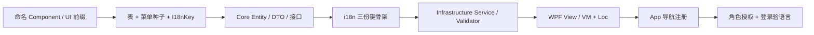

# WF MES 新模组开发流程（含多语言）

> 适用：`WF.MES.Core` / `WF.MES.Infrastructure` / `WF.MES.WPF`  
> 文档版本：2026-07-14  
> 核心原则：**ViewModel 只依赖 Core 接口，业务逻辑在 Infrastructure，WPF 只管 UI 与导航；翻译与功能同步交付**

更细的三端键协议见仓库 [i18n/README.md](../../../i18n/README.md)。

---

## 1. 分层与目录

| 内容 | 项目 | 路径示例 |
|------|------|----------|
| 接口、常量、DTO、Entity | WF.MES.Core | `Core/Interfaces/`、`Models/Dtos/`、`Models/Entities/` |
| Service、SqlSugar、Validator | WF.MES.Infrastructure | `Services/`、`Validation/` |
| View、ViewModel | WF.MES.WPF | `Modules/{Component前缀}/` |
| 壳层 / 登录 | WF.MES.WPF | `Shell/`、`Auth/` |
| UI 本地化辅助 | WF.MES.WPF | `Ui/`（`Loc*`，勿与 Infrastructure 混淆） |
| 菜单 / 权限 | Web 后台 + `database/sql/03_seed_data.sql` |

```
WF.MES.WPF/
├── Auth/                 # 登录、改密、选厂
├── Shell/                # 主壳 + 侧栏
├── Ui/                   # Loc.Key / Lf / Ex / LocDataGrid*
├── Modules/
│   ├── Mes/              # Component: Mes.*
│   ├── Material/         # Component: Material.*
│   ├── Barcode/          # Component: Barcode.*
│   └── Equipment/        # Component: Equipment.*
├── Assets/  i18n/  Docs/
└── App.xaml.cs           # RegisterForNavigation 须与 System_Menu.Component 一致
```

**依赖方向（单向）：**

```
WF.MES.WPF  →  WF.MES.Infrastructure  →  WF.MES.Core
```

ViewModel **禁止**引用 `WF.MES.Infrastructure.*`（含 static helper、SqlSugar、Validator 具体类）。

---

## 2. 开工前：命名约定

先定名称，后续步骤全部对齐：

| 项 | 示例 | 规则 |
|----|------|------|
| Component（Prism 导航名） | `Quality.Inspect` | `{前缀}.{页面}`，全局唯一 |
| 目录 | `Modules/Quality/` | **文件夹名 = Component 前缀** |
| 权限码 | `quality:inspect:list` | 与种子 `Permission` 一致 |
| 菜单 I18nKey | `menu.desktop.qualityInspect` | 与三端 `menu.*` 键协议一致 |
| UI 文案前缀 | `ui.quality.*` | 模块专属；通用字段复用 `ui.fields.*` |

---

## 3. 推荐交付顺序



**翻译不要放最后**：第 D 步先把键和空英文骨架建好，UI 只绑 key。

---

## 4. 分步说明

### 第 1 步：数据库

1. 在 [database/sql/](../../../database/README.md) 的 `02_create_tables.sql` 增加业务表（或增量脚本）
2. 在 `03_seed_data.sql`（或 Web **菜单管理**）增加桌面菜单：`ClientType=3`
   - 父目录 MenuType=1（如需要）
   - 页面 MenuType=2，`Component` 与 Prism 导航名一致
   - 受控按钮 MenuType=3，填写 `Permission`
3. 为角色勾选菜单（种子或 Web 角色管理）

菜单行须齐全：`Component`、`Permission`、`I18nKey`、`MenuName`（TitleFallback）。

### 第 2 步：Core

| 产出 | 路径 |
|------|------|
| Entity | `WF.MES.Core/Models/Entities/` |
| DTO（List / Edit / Query） | `WF.MES.Core/Models/Dtos/` |
| 常量 | `WF.MES.Core/Core/Constants/` |
| 接口（**一文件一接口**） | `WF.MES.Core/Core/Interfaces/IXxxService.cs` |

```csharp
public interface IQualityInspectService
{
    Task<IReadOnlyList<QualityInspectListDto>> GetListAsync(...);
    Task SaveAsync(QualityInspectEditDto dto, CancellationToken ct = default);
}
```

DTO **只存原始值**（int / string），不要 `StatusText` 一类显示字段。

### 第 3 步：多语言键骨架（与功能同步）

改桌面三份包：`WF.MES.WPF/i18n/{zh-CN,zh-TW,en}.json`。

#### 键树（必须遵守）

| 前缀 | 用途 | 示例 |
|------|------|------|
| `menu.desktop.*` | 侧栏标题（对应 DB `I18nKey`） | `menu.desktop.qualityInspect` |
| `ui.fields.*` | 字段名（**无冒号**） | `ui.fields.batchNo` |
| `ui.actions.*` | 通用按钮 / 动词 | `ui.actions.save` |
| `ui.{模块}.*` | 本模块标题、提示、格式化句 | `ui.quality.inspectTitle` |
| `ui.punct.colon` | 字段标签冒号（已有，勿重复造） | 中文 `：` / 英文 `: ` |
| `err.*` | 业务异常（`BusinessException`） | `err.quality.batchNotFound` |
| `val.*` | FluentValidation | `val.batchNoRequired` |
| `auth.*` / `session.*` / `factory.*` / `common.*` | 与后端 `messageCode` 对齐 | `auth.invalid_credentials` |

**禁止：**

- 在 `ui.{模块}.*` 里塞异常键 → 异常一律 `err.*`
- 校验文案写进 `ui.*` → 校验一律 `val.*`
- XAML / Core 常量硬编码中文
- DTO 增加 `*Text` 显示字段

API 错误码若走三端协议：先改 `i18n/api-codes/*.json`，再执行：

```powershell
./i18n/scripts/sync-desktop.ps1
```

#### 标准写法（日常只用这些）

| 场景 | 写法 |
|------|------|
| XAML 按钮 / 标签 / 复选框 | `infra:Loc.Key="ui.actions.add"` |
| XAML 表单字段标签（带冒号） | `infra:Loc.FieldLabelKey="ui.fields.customer"`（冒号走 `ui.punct.colon`） |
| DataGrid 列头 | `<infra:LocDataGridTextColumn LocKey="ui.fields.customer" …/>` |
| DataGrid 枚举 / 状态列 | `<infra:LocDataGridEnumColumn LocKey="…" EnumMap="{x:Static infra:LocEnumMaps.Xxx}" …/>` |
| ViewModel 标题 / Growl / 拼接 | `L("…")` / `Lf("ui.quality.savedCount", n)` / `Ex(ex)` |
| 下拉选项 | `LocalizedOptions.*(L)`，在**构造函数**中构建一次 |
| 启动早期（无 DI） | `WpfLocalization.T("ui.app.tip")` |

```xml
xmlns:infra="clr-namespace:WF.MES.WPF.Ui"

<Button infra:Loc.Key="ui.actions.add" Command="{Binding AddCommand}" />
<TextBlock infra:Loc.FieldLabelKey="ui.fields.customer" />
<infra:LocDataGridTextColumn LocKey="ui.fields.batchNo" Binding="{Binding BatchNo}" />
```

**语言切换：** 仅登录页可选；写入 `%LocalAppData%/WF.MES/wf_locale.txt` 并刷新登录文案。进入主界面后不提供语言热切换。下拉选项等在构造 / 导航加载时按当前语言建一次即可。

**FieldLabelKey 含义：** 自动拼接「字段文案 + 本地化冒号」，避免写死 `客户：` 或 `L(key) + ":"`。

壳层 / 登录的**静态**文案用 `Loc.Key`；仅动态句（状态栏、欢迎语、格式化版本号、HandyControl Placeholder 等）留在 ViewModel。菜单侧栏绑定 `DisplayName`（`I18nKey` + `TitleFallback`，加载时翻译一次）。

#### 枚举列

新状态 / 枚举须在 `Ui/LocEnum.cs` 静态构造中注册，并增加 `LocEnumMaps` 常量。**DTO 只存原始值**，列表文案由 `LocEnumConverter` 翻译。

#### 高级（可选）

| 场景 | 写法 |
|------|------|
| 标签 + 值一行 | `<infra:LocInfoField LabelKey="ui.fields.customer" ValuePath="CustomerName" />` |
| 整句格式化（XAML） | `LocFormatConverter` + `MultiBinding` |

#### 异常与校验

- Service：`throw new BusinessException("err.xxx", args…)`；UI：`Growl.Error(Ex(ex))`
- 平台 API 拆包：`ApiResponseHelper.EnsureData(result, "err.xxx")`；messageCode 解析：`ApiErrorHelper.ResolveMessage`
- FluentValidation：注入 `ILocalizationService`，消息键 `val.*`

CSV 导出表头：Service 注入 `ILocalizationService` 取 `ui.{模块}.exportCsv.*`，或返回数值由 VM `Lf()` 格式化。

#### Ui 基础设施（业务模块勿再拆新类）

| 文件 | 内容 |
|------|------|
| `Ui/Loc.cs` | `Loc` / `WpfLocalization` / `LocalizationBindingSource` |
| `Ui/LocalizedViewModelBase.cs` | `L` / `Lf` / `Ex` |
| `Ui/LocColumns.cs` | DataGrid 文本列 / 枚举列 |
| `Ui/LocEnum.cs` | 枚举 map（`LocEnumMaps`） |
| `Ui/LocConverters.cs` | 枚举 / 格式 Converter、`LocalizedOptions` |
| `Ui/LocInfoField.cs` | 信息面板字段行 |

### 第 4 步：Infrastructure

1. Service → `WF.MES.Infrastructure/Services/{模组}/`
2. Save / 关键写入口调用 `_validator.ValidateRequestAsync(dto)`
3. Validator → `WF.MES.Infrastructure/Validation/{模组}/`
4. 在 `InfrastructureServiceRegistration.cs` 注册：

```csharp
containerRegistry.RegisterSingleton<IQualityInspectService, QualityInspectService>();
containerRegistry.Register<IValidator<QualityInspectEditDto>, QualityInspectEditValidator>();
```

产线业务**直连 SqlSugar**，禁止用 Refit 做业务 API。

### 第 5 步：WPF 界面

```
WF.MES.WPF/Modules/{Component前缀}/
├── Views/
│   └── XxxView.xaml + .xaml.cs
└── ViewModels/
    └── XxxViewModel.cs   // : LocalizedViewModelBase, INavigationAware
```

ViewModel 规范（参考 `Modules/Barcode/ViewModels/CustomerManageViewModel.cs`）：

- 构造函数 **只注入 Core 接口**（如 `IXxxService`、`ISessionService`、`ILocalizationService`）
- 列表页实现 `INavigationAware`，在 `OnNavigatedTo` 加载数据
- 不 `using WF.MES.Infrastructure.*`
- 操作人使用 `_sessionService.CurrentOperatorName`
- 打印使用 `_printService.CreatePrintRequest(...)`，不直接调 Infrastructure 工具类

### 第 6 步：Prism 导航注册

在 `App.xaml.cs` → `RegisterModuleViews`：

```csharp
containerRegistry.RegisterForNavigation<QualityInspectView, QualityInspectViewModel>("Quality.Inspect");
```

**字符串必须与 `System_Menu.Component` 完全一致。**

### 第 7 步：按钮权限（有受控操作才做）

| 层级 | 配置 | 含义 |
|------|------|------|
| 菜单 | MenuType=2 + `System_Role_Menu` | 能否进入页面 |
| 按钮 | MenuType=3 的 `Permission` | 桌面 `MenuActions` + `HasAction` |

Checklist：

1. `03_seed_data.sql` 增加 MenuType=3，`Permission` 如 `quality:inspect:approve`
2. `MenuActions.cs` 增加同名常量
3. ViewModel：`CanXxx => _auth.HasAction(...)`
4. Service 写入口：`EnsureAction`
5. Web 角色勾选后，重新登录桌面验证

---

## 5. 数据流

**平台门票（API，无 Refresh Token）**

```
登录 / 选厂 / 改密 / 登出 / 桌面菜单
  → IAuthService / IMenuPermissionService
  → Refit IAuthApi（AuthApiFactory）
  → WF.MES.Api
```

> 多工厂仅在登录流程选厂；桌面进入主界面后不再「切换工厂」。

**产线业务（直连 DB）**

```
用户操作
  → View (XAML)
  → ViewModel
  → Core 接口 (IXxxService)
  → Infrastructure Service
  → FluentValidation + SqlSugar
  → SQL Server（ConnectionStrings:WfMesDb）
```

---

## 6. 两种页面形态

| 类型 | 场景 | 注册方式 |
|------|------|----------|
| 主导航页 | 侧栏进入 | `RegisterForNavigation<View, ViewModel>("Component")` |
| 弹窗 | 生成结果、审核等 | 父 ViewModel 打开 Window；VM 仍只注入 Core 接口 |

---

## 7. 联调清单

- [ ] 菜单可见，点击能导航到页面（Component 一致）
- [ ] Service CRUD / 业务逻辑正常
- [ ] 中 / 英 / 繁：界面、菜单、校验、异常均可译出（缺键会露出 key）
- [ ] `FieldLabelKey` 在英文下冒号为半角风格
- [ ] 枚举列走 LocEnum，无手写中文
- [ ] Validator / `BusinessException` → `Growl.Error(Ex(ex))`
- [ ] Serilog 有关键日志；审计字段在 Service 填充 CreatedBy / UpdatedBy
- [ ] 受控按钮无权限时不可点，并在角色权限中勾选验证

---

## 8. 快速对照：新增示例页

假设新增 `Quality.Inspect`：

| 顺序 | 文件 / 动作 |
|------|-------------|
| 1 | `database/sql/02_create_tables.sql`（表） |
| 2 | `database/sql/03_seed_data.sql`（菜单 + `I18nKey` + Permission） |
| 3 | Core：Entity / Dtos / `IQualityInspectService.cs` |
| 4 | `i18n/zh-CN.json`、`zh-TW.json`、`en.json`（`menu.*` / `ui.quality.*` / `err.*` / `val.*`） |
| 5 | `Infrastructure/Services/Quality/QualityInspectService.cs` |
| 6 | `Infrastructure/Validation/Quality/…Validator.cs` |
| 7 | `InfrastructureServiceRegistration.cs`（+2 行） |
| 8 | `WPF/Modules/Quality/Views/QualityInspectView.xaml` |
| 9 | `WPF/Modules/Quality/ViewModels/QualityInspectViewModel.cs` |
| 10 | `App.xaml.cs`（+1 行导航） |
| 11 | Web 角色勾选 → 重新登录桌面 |

物料类页面放在 `Modules/Material/`（Component `Material.*`）。

---

## 9. 开发红线

1. ViewModel 不要引用 Infrastructure（含 static helper、SqlSugar）
2. 不要在 WPF 注册 Service — 统一在 `InfrastructureServiceRegistration.cs`
3. 不要在 Core 自行读取程序集版本 — 使用注入的 `IAppVersion`
4. ViewName / Component 必须与 `System_Menu.Component` 一致
5. 校验写在 Infrastructure Validator + Service 入口，不要只在 ViewModel 写
6. 禁止产线模块使用 Refit 业务 API
7. 禁止：`IDesktopUiText`、`BindingProxy`、Core 常量写中文 Display、DTO `*Text`、VM 手拼多语言详情行

---

## 10. 关键文件索引

| 用途 | 路径 |
|------|------|
| DI 注册 | `WF.MES.Infrastructure/InfrastructureServiceRegistration.cs` |
| Prism 导航 | `WF.MES.WPF/App.xaml.cs` → `RegisterModuleViews` |
| 版本注入 | `WF.MES.WPF/Ui/EntryAssemblyAppVersion.cs` |
| 桌面 UI 语言包 | `WF.MES.WPF/i18n/{zh-CN,zh-TW,en}.json` |
| 三端 i18n 协议 | [i18n/README.md](../../../i18n/README.md) |
| 菜单种子 | `database/sql/03_seed_data.sql`（Desktop `ClientType=3`） |
| 数据库说明 | [database/README.md](../../../database/README.md) |
| 桌面脚本说明 | `WF.MES.WPF/Scripts/README.md` |
| ViewModel 参考 | `Modules/Barcode/ViewModels/CustomerManageViewModel.cs` |

---

## 11. 后续扩展（Web API / Windows Service）

同一套 **Core 接口 + Infrastructure Service** 可复用：新建宿主并注册相同 Service，**不必重写业务逻辑**，仅替换 UI 层。

---

*WF 制造执行系统 · 内部开发文档*
